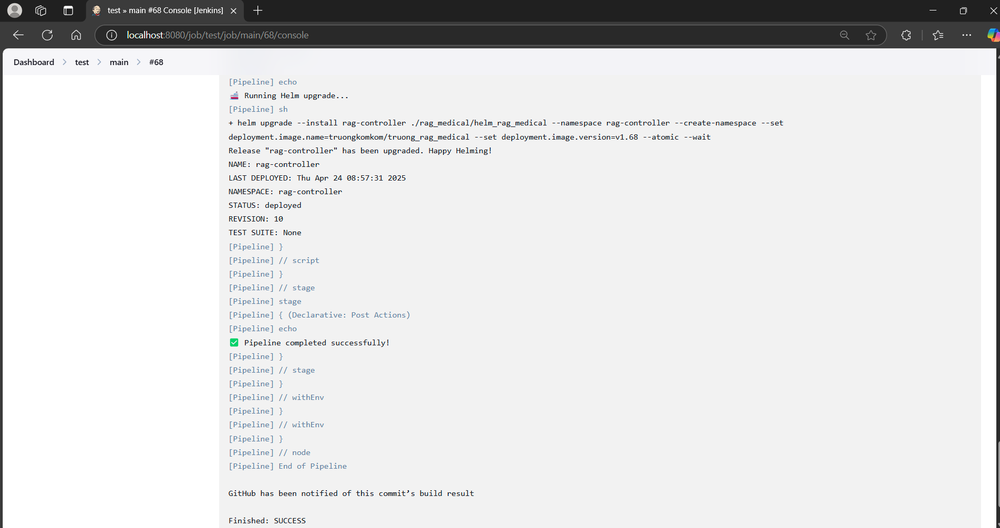
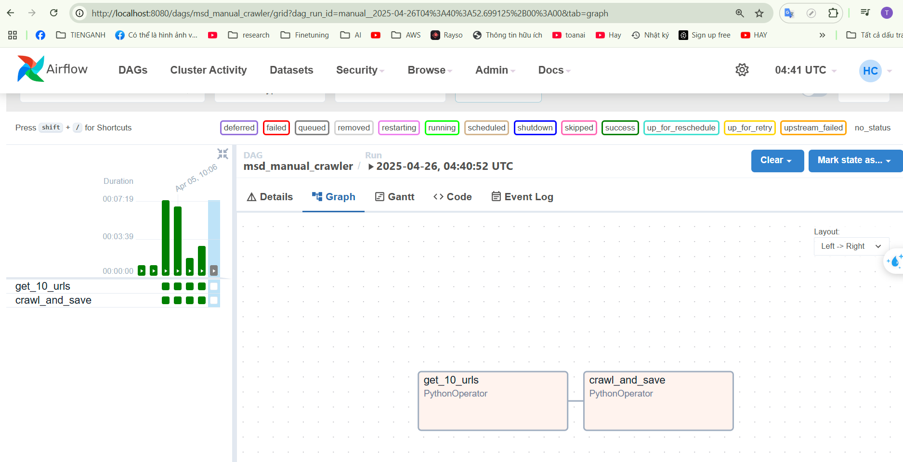
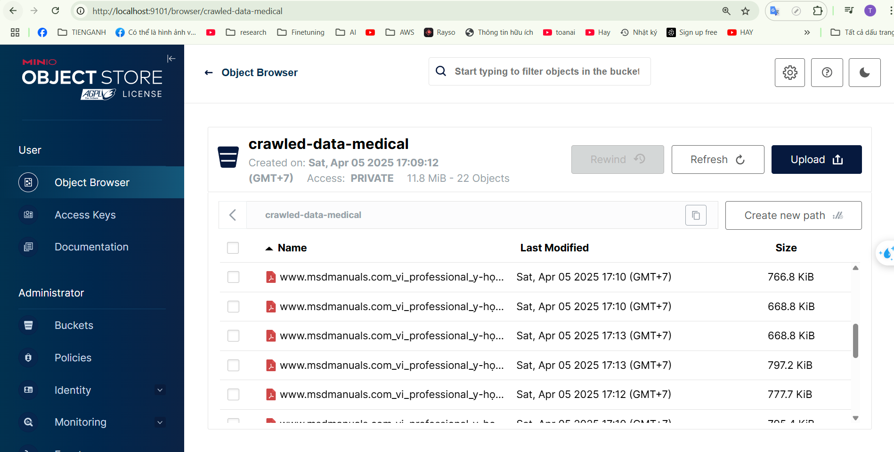
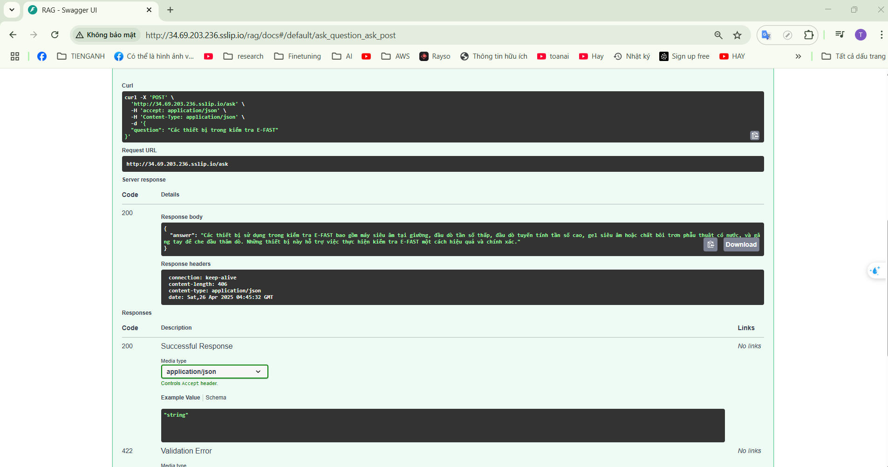
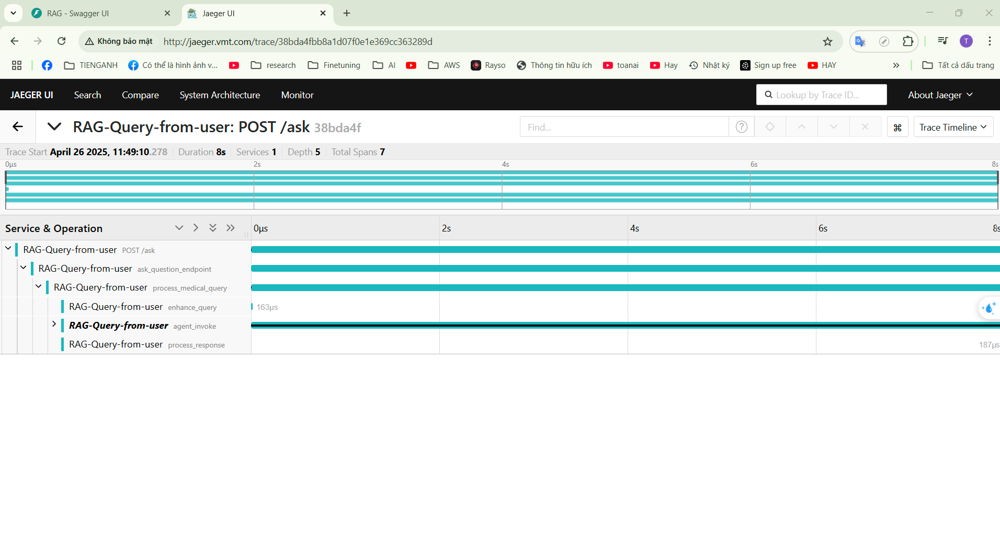
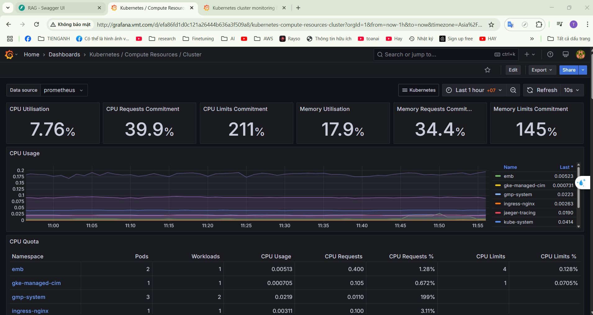

# 🌟 **Tổng Quan**

**LastDance** là một ứng dụng hiện đại dựa trên kiến trúc microservices, sử dụng các công nghệ tiên tiến để xây dựng một kiến trúc mạnh mẽ và có khả năng mở rộng. Dự án tuân thủ các phương pháp tốt nhất trong phát triển phần mềm, bao gồm tích hợp liên tục / triển khai liên tục (CI/CD), tự động hóa quy trình làm việc, giám sát, và theo dõi phân tán.

---

## 🔧 **Các Thành Phần Kiến Trúc**

### 1. **Jenkins (CI/CD)** 🏗️

- Tự động hóa quy trình xây dựng và triển khai trên GKE

---

### 2. **Apache Airflow** 🌬️

- Tự động crawling và store xuống Minio

---

### 3. **MinIO** 📦

- Lưu trữ file pdf

---

### 4. **Dịch vụ API** 🌐

- Kiểm tra endpoints

---

### 5. **Jaeger** 🕵️‍♂️

- Hệ thống theo dõi phân tán microservices

---

### 6. **Prometheus & Grafana** 📊

- Thu thập và giám sát chỉ số hệ thống

---